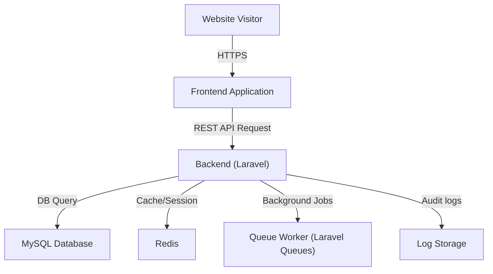

# Eurizon Hungary – System Architecture Diagram

---

**Legend:**
- **Website Visitor:** End users and staff accessing public pages or admin panel.
- **Frontend Application:** UI built with Laravel/Livewire, communicates with backend via secure REST API.
- **Backend (Laravel/Livewire/AlpineJS):** Handles business logic, authentication, content management, calculations, and API requests.
- **MySQL Database:** Stores content, users, roles, financial data, and versioning info.
- **Redis:** Used for caching, sessions, and speeding up queries.
- **Queue Worker (Laravel Queues):** Processes background jobs (e.g., yield calculations, scheduled tasks).
- **Log Storage:** Stores audit logs for compliance and traceability.

---
