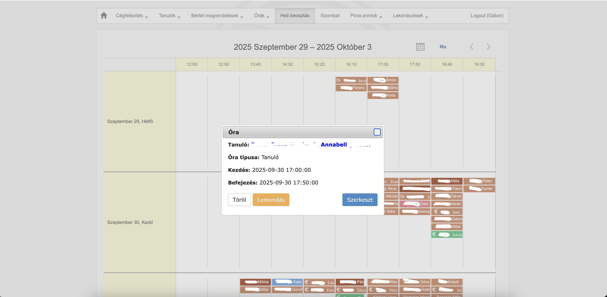

# Drumkiller Dobcentrum Budapest – Student, Lesson & Pass Management System

**Client:** Drumkiller Dobcentrum Budapest  
**Period:** 2018–present  
**Role:** Full-stack Developer  
**Technologies:** Yii1, MySQL   

---

## Overview

Management system for a Budapest-based music school specializing in drum lessons. The platform handles student registration, lesson scheduling, pass management, payments, attendance tracking, and reporting via a secure admin panel.

Originally begun by another developer, I took over the project, led a small team to completion, and continued solo development, adding features and enhancements to meet evolving client requirements.

---

## Main Technologies

- **Backend:** PHP (Yii1 Framework)
- **Database:** MySQL

---

## Main Features

- **Student Registration & Management:** Centralized student profiles with contact info, history, and lesson tracking.
- **Lesson Scheduling:** Calendar-based management for lessons and teacher assignments.
- **Pass & Payment Management:** Flexible system for managing lesson passes, payment tracking, and validity.
- **Attendance Tracking:** Digital attendance records for each lesson.
- **Reporting & Statistics:** Performance dashboards, student progress, revenue, and lesson history.
- **Role-based Admin Panel:** Separate permission levels for admins and teachers, streamlined workflows.

---

## Technical Challenges & Solutions

- **Project Takeover:** Inherited an incomplete codebase, refactored and extended core logic to deliver a stable product.
- **Collaboration & Leadership:** Initially led a small team to finalize MVP; continued as sole developer for new features and ongoing support.
- **Custom Calendar Management:** Developed a user-friendly calendar view for lesson scheduling, including conflict detection and teacher assignments.
- **Data Security:** Implemented role-based access and data protection for sensitive student/payment info.
- **Reporting Customization:** Built tailored reports and dashboards to meet business intelligence needs.

---

## My Contributions

- Led the finalization and launch of the system after takeover.
- Architected and implemented new features (calendar, reporting, attendance).
- Provided ongoing maintenance, support, and improvements.
- Direct client communication, requirements gathering, and training.

---

## Results & Impact

- The system streamlined administrative tasks, significantly reducing manual work.
- Staff can manage students, lessons, and payments efficiently in a single platform.
- Improved business insights through comprehensive reporting.
- Enhanced organization and reduced errors in scheduling and payment tracking.

---

## User Types

- **Admins:** Full system access, manage all aspects of the platform.
- **Teachers:** Manage their assigned students, lessons, and payments.

*Note: The system is closed; only staff have access.*

---

## Deployment

- Hosted on a shared hosting server.

---

## Screenshots

---

## System Architecture Diagram

---

**Legend:**
- **Admin/Teacher (Staff):** System users, staff only.
- **Web Browser:** Interface for accessing the admin panel and features.
- **Backend (PHP/Yii1):** Business logic, authentication, scheduling, reporting.
- **MySQL Database:** Data storage for students, lessons, attendance, payments.

---
