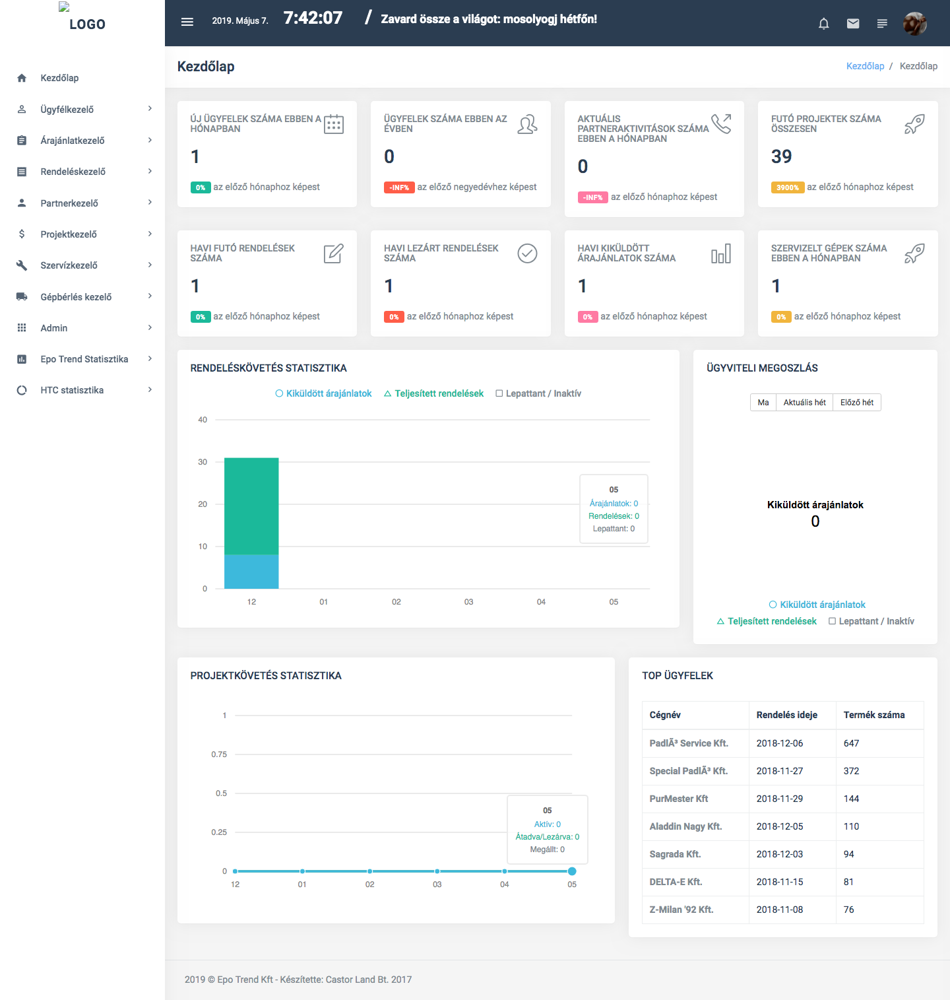
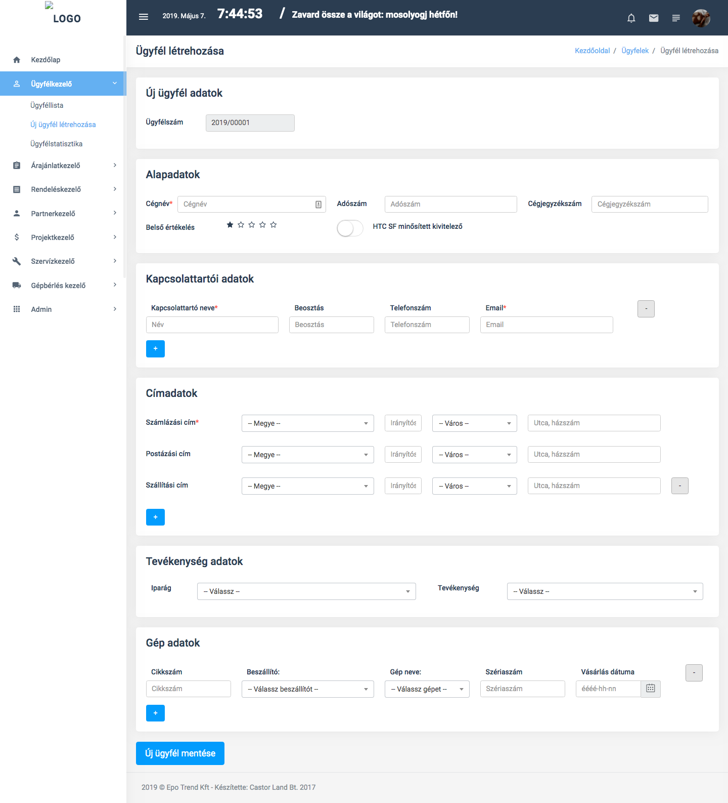
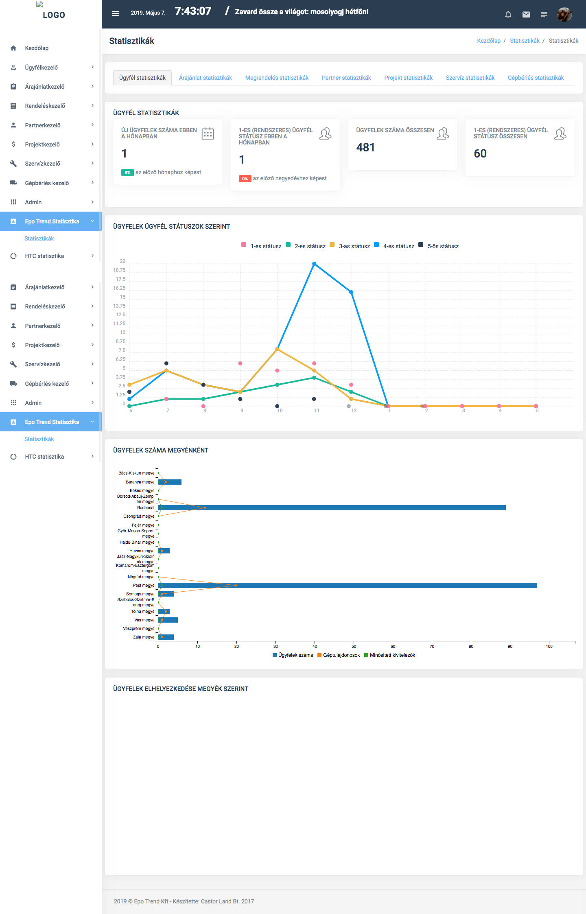
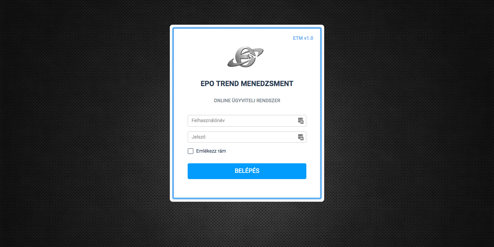

# Enterprise Management System

**Client:** Private Company
**Period:** 2018–2020  
**Role:** Full-stack Developer  

---

## Overview

This EMS is built for one of my clients based on a unique specification. This company wanted a fully customised solution for their works and statistics.

They can record:
- Incoming inquiries
- Orders
- Project statuses
- Reminders and notifications
- Machine renting
- Customers
- Invoices
- Charts and statistics
- And many more...

The system is built with a legacy PHP framework and MySQL database. The frontend uses plain JavaScript for interactivity.

---

## Main Technologies
- **Backend:** PHP (legacy, without framework)
- **Database:** MySQL
- **Frontend:** JavaScript

---

## Core Features

- **Inquiry Management:** Track and manage incoming inquiries from potential clients.
- **Order Processing:** Handle order creation, updates, and status tracking.
- **Project Tracking:** Monitor project progress and milestones.
- **Reminder System:** Automated notifications for important tasks and deadlines.
- **Machine Rental Management:** Oversee the rental of machinery and equipment.
- **Customer Database:** Maintain detailed records of customers and their interactions.
- **Reporting & Statistics:** Generate charts and reports for business insights.

---

## My Contributions

- Developed the entire system from scratch based on client specifications.
- Designed the database schema to support various business processes.
- Implemented backend logic for managing inquiries, orders, projects, and more.
- Created a user-friendly frontend interface with JavaScript for interactivity.

---

## Results & Impact

- The EMS streamlined the client's operations, reducing manual work and improving efficiency.
- Provided valuable business insights through comprehensive reporting and statistics.
- Enabled better management of customer relationships and project tracking.

---

## User Types

- **Admins:** Full access to all system features and settings.
- **Staff:** Limited access based on roles and responsibilities.

---

## Deployment

- Hosted on the client's internal servers with regular backups and maintenance.

## Screenshots

- 
- 
- 
- 
