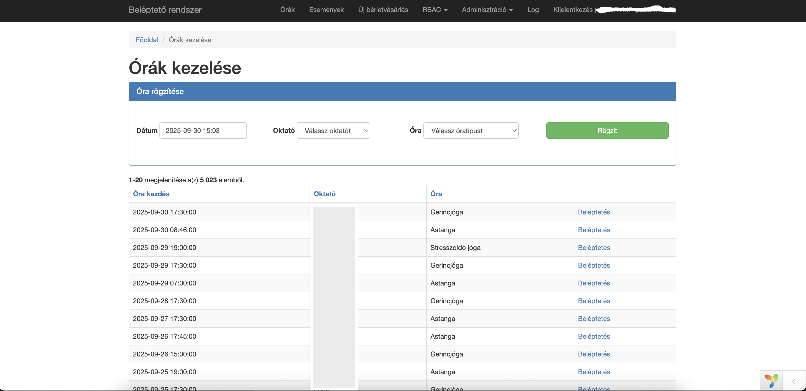
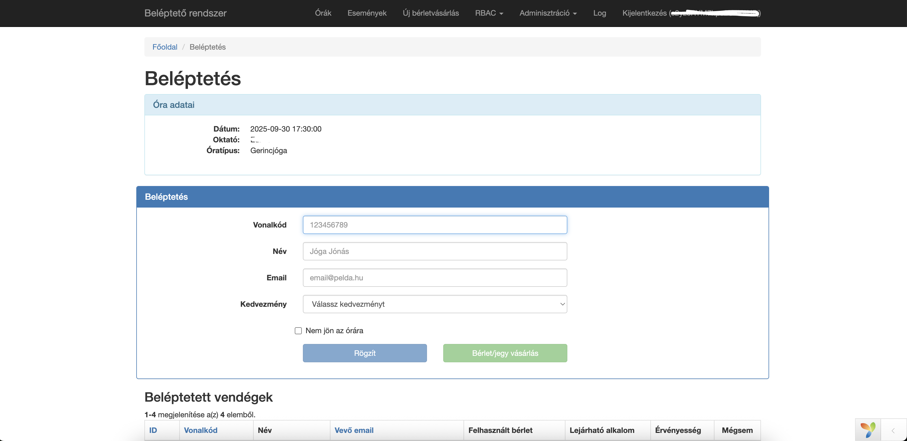
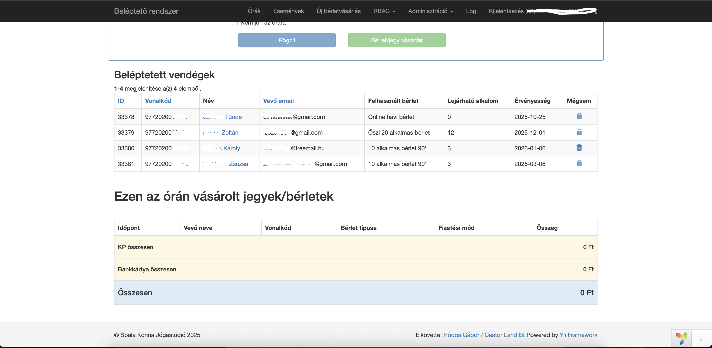
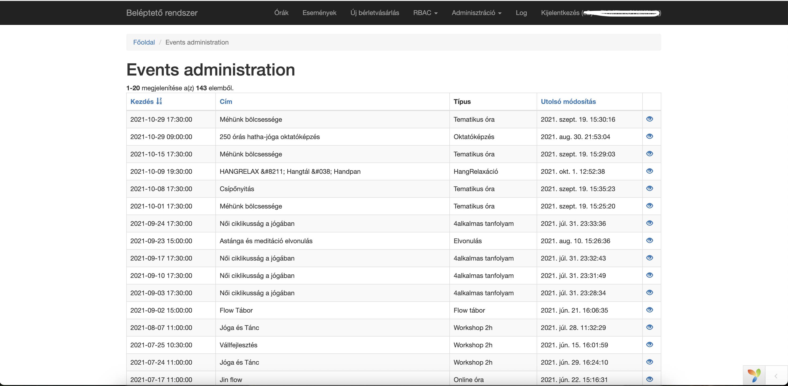
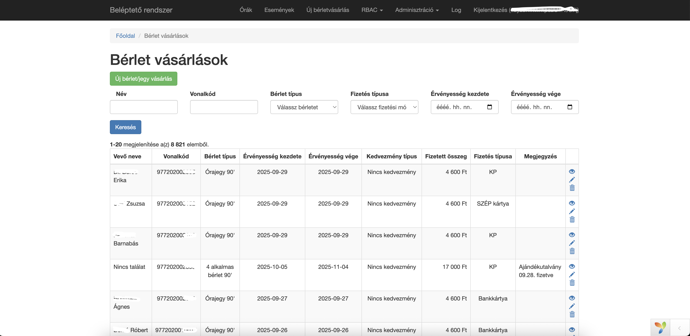
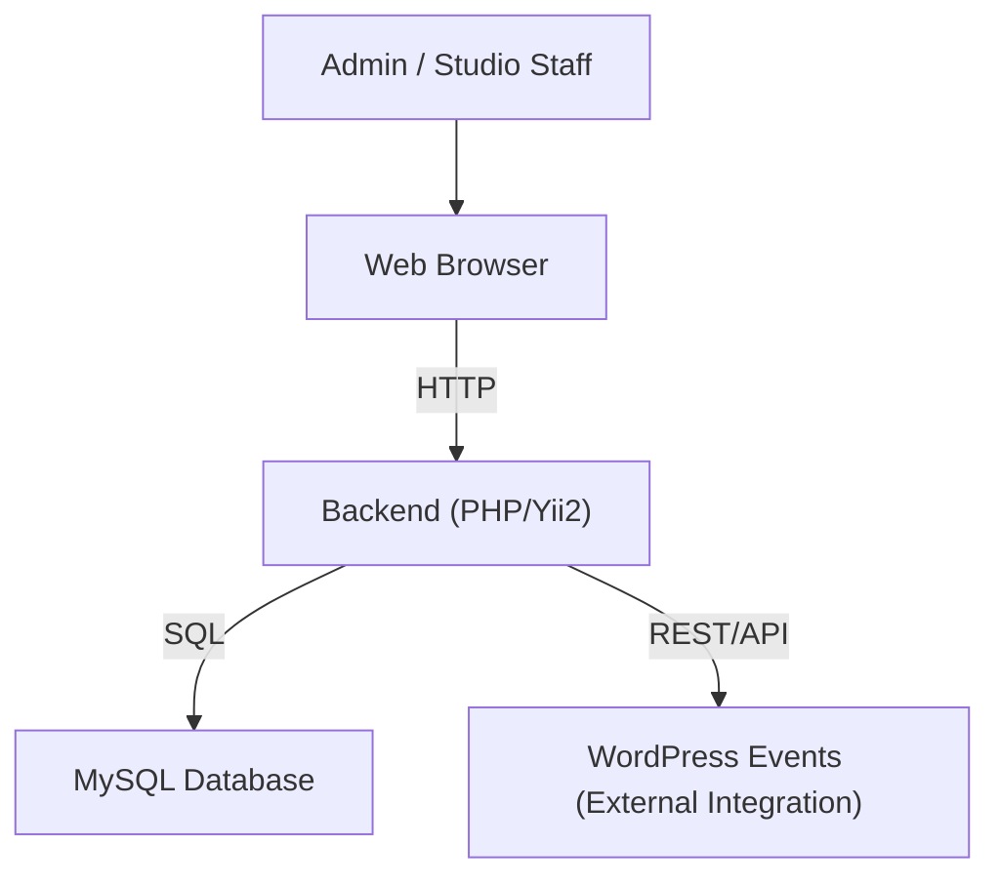

# Spala Kori Jógastúdió – Custom Student Management System

**Client:** Spala Kori Jógastúdió  
**Period:** 2021–present  
**Role:** Full-stack Developer

---

## Overview

A tailor-made customer management system for a yoga studio, built entirely from scratch to support daily operations and business insights. The platform streamlines customer registration, class scheduling, pass management, attendance tracking, and reporting for studio staff. It also integrates directly with WordPress Events to display and manage workshop and class schedules inside the admin panel.

---

## Main Technologies

- **Backend:** PHP (Yii2 Framework)
- **Database:** MySQL
- **Infrastructure:** Shared hosting

---

## Core Features

- **Customer Registration & Management:** Centralized profiles for all studio clients, with contact details and history.
- **Class Scheduling:** Calendar-based scheduling and management for regular lessons and special events.
- **Pass & Payment Management:** Tracks lesson passes, purchase history, and payment status.
- **Attendance Tracking:** Digital check-in and attendance monitoring for each class.
- **Reporting & Statistics:** Automated generation of business reports and customer analytics.
- **Admin Panel:** Custom backend interface for studio staff with role-based access.
- **WordPress Events Integration:** Synchronizes event data from the studio’s WordPress site for seamless event management.

---

## My Contributions

- Designed and implemented the entire system architecture, database schema, backend logic, and frontend interfaces.
- Developed all core modules: customer registration, scheduling, pass management, attendance, and reporting.
- Built the admin panel from scratch for efficient day-to-day operation by studio staff.
- Integrated WordPress Events to ensure up-to-date event information in the backend.
- Maintained the system, provided regular database backups, and handled all business-critical improvements.

---

## Results & Impact

- Enabled the client to manage all studio operations efficiently in a single platform.
- Reduced administrative overhead, improved scheduling accuracy, and enhanced business insight through detailed reporting.
- Integrated event management streamlined both class booking and special workshop organization.

---

## User Types

- **Admins & Studio Staff:** Use the backend to manage customers, classes, passes, and events.

---

## Deployment

- **Hosting:** Shared hosting provider
- **Backup:** Regular database backups; no Docker or CI/CD

---

## Screenshots

---

## System Architecture Diagram

---

**Legend:**
- **Admin / Studio Staff:** System users, studio operators.
- **Web Browser:** User interface for system access.
- **Backend (PHP/Yii2):** Application logic, authentication, scheduling, reporting.
- **MySQL Database:** Storage for customer, class, attendance, and pass data.
- **WordPress Events:** External event data source, integrated for workshop/event management.

---
